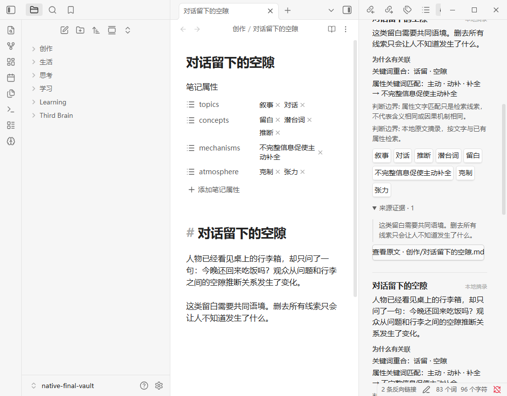

# Third Brain

Reconnect an idea with fragments from your own notes, see why they match, and open the original — inside Obsidian.

**[Download 0.3.2 preview](https://github.com/Yueyue673/obsidian-third-brain/releases/download/0.3.2/third-brain-0.3.2.zip)** · [Install](#install) · [中文](README.zh-CN.md) · [Privacy](docs/PRIVACY.md)



*Native Obsidian, earlier build, synthetic notes and local excerpts. Not a public-package installation or live-AI demo.*

> **0.3.2 preview · desktop Obsidian 1.11.5+ · not in the Community directory.**
> Default local excerpts need no key or network; they are not AI semantic search. A small real-model synthetic check and cached-result activation check exist; production-provider compatibility, broad semantic quality and native clicks for this version remain unverified.

## Install

Start in a disposable test vault. Node.js is **not** needed to install the plugin.

1. Download the [plugin ZIP](https://github.com/Yueyue673/obsidian-third-brain/releases/download/0.3.2/third-brain-0.3.2.zip) and [SHA256SUMS](https://github.com/Yueyue673/obsidian-third-brain/releases/download/0.3.2/SHA256SUMS) from the [0.3.2 prerelease](https://github.com/Yueyue673/obsidian-third-brain/releases/tag/0.3.2). [Compare the ZIP's SHA-256](docs/GETTING-STARTED.md#check-the-download), then extract it.
2. Create `.obsidian/plugins/third-brain/` inside that vault. Put **`main.js`, `manifest.json`, `styles.css` and `LICENSE`** directly inside — no extra nested folder.
3. Reload Obsidian, allow Community plugins if prompted, and enable **Third Brain** in **Settings → Community plugins**. Open the brain ribbon icon, then select **Refresh notes**.

Community plugins have broad access. Review the code and keep a backup before using an important vault. [Installation help](docs/TROUBLESHOOTING.md).

## Find your first connection

Describe an idea → **Find connections** → read the explanation → expand **Source evidence** → **Open original**. You do not need to find an old note or know a tag first.

- **Keep originals separate.** Generated Markdown and its index live in `Third Brain/Fragments` by default. Originals stay read-only; user-authored or edited output is protected.
- **Inspect the reason, not just the result.** Cards distinguish text and facet matches, show source quotations, and label analogy limits. Click a facet to explore; low/medium/high breadth changes the search scope, not evidence requirements.
- **Refresh on your terms.** Manual by default, with optional daily/weekly refresh while Obsidian is open. No automatic insertion, keystroke stream, click/dwell tracking or telemetry.

Need notes to try it? Copy the explicitly synthetic [sample notes](fixtures/sample-vault) into your test vault, refresh once, and search for `留白` or `Change one variable at a time`. An empty vault or insufficient context can produce no results; nothing is invented to fill the list. [First-run guide](docs/GETTING-STARTED.md#first-connection).

## High-breadth indirect suggestions

With **High** breadth, an existing direct mechanism/analogy match can lead one step through the same-privacy fragment network. Cards label this **Indirect association suggestion**, name the anchor and shared mechanism, and let you expand **Compare both original sources** to inspect both quotations, conditions and source buttons. This does not establish equivalence to your query or a causal relationship. Low/medium behaviour is unchanged.

Expansion is deliberately bounded (3 anchors, 3 inspected neighbors per anchor, at most 6 targets). The original main list keeps its order, scores and up to seven results. High can show at most two additional, source-checked targets in a separate **Indirect suggestions via the existing network** section, with its count in the result summary. Suggestions never take a main-list slot or increase its scores; without a qualifying path there is no extra section. The existing Open fragment action and both original-source controls remain available.

## Follow a saved connection

From a search result, choose **Open fragment**. Its **Related fragments** section links to generated fragments with specific shared topics, concepts or mechanisms; each fragment keeps its original quotations and source links. Human-readable title aliases are included. These are bounded same-privacy suggestions from existing attributes, not proof of semantic or causal equivalence.

## Local excerpts or a model?

| Mode | What it does | What you need |
| --- | --- | --- |
| Local excerpts — default | Extracts passages and retrieves text/existing-facet matches; **not AI semantic understanding** | No account, key or network |
| Local model — optional | Uses a configured OpenAI-compatible model to edit grounded fragments and interpret queries | Your own loopback service and model name |
| Cloud model — optional | May send ordinary note text and your query to the chosen provider; local/private sources and their vocabulary are excluded | HTTPS endpoint, host-managed secret and explicit consent |

[Model setup](docs/GETTING-STARTED.md#optional-model-setup) · [Privacy boundaries](docs/PRIVACY.md)

## When refresh stops

The panel names the affected vault-relative source, reading/decoding/parsing/analysis stage and controlled reason, and retains the last progress. A first failed refresh says that no complete index exists; a pre-commit failure with a previous revision preserves that revision without treating changed/unreadable sources as current evidence. Reading can be cancelled without starting the next source; this is cooperative cancellation, not an OS I/O hard stop. The committing label is distinct from processing completion. Fix or explicitly exclude the reported source before retrying; the plugin never skips unknown privacy or invalid model output to save a partial run.

## Scope and limits

- Desktop only; readable Markdown and Canvas text nodes. No mobile support.
- Source changes invalidate old evidence. Missing sources are not kept as live recommendations; refresh after editing notes.
- Quotes prove provenance, not the truth of every interpretation. Recall improvement, knowledge mastery and universal relevance are not established.
- Redaction cannot identify every confidential detail. Mark sensitive notes local/private or exclude them **before** enabling cloud processing. Generated history is not encrypted or guaranteed to be erased when a source is removed.
- Stored fragment links and legacy upgrades are checked on synthetic filesystem fixtures. The Open fragment and two-source suggestion controls are wired into the native panel and checked in a DOM harness; native-host clicks and broad live-AI quality are not yet verified for 0.3.2. [Verification scope](docs/VERIFICATION.md) distinguishes earlier native checks.

[Compatibility and limits](docs/COMPATIBILITY.md) · [Troubleshooting](docs/TROUBLESHOOTING.md)

## Develop

Source builds require Node **22.12+** and npm; installation from the release does not.

```sh
git clone https://github.com/Yueyue673/obsidian-third-brain.git
cd obsidian-third-brain
npm ci --ignore-scripts
npm run build
```

Copy **`dist/main.js`, `dist/manifest.json`, `dist/styles.css` and `dist/LICENSE`** to the plugin folder above. [Contributing](CONTRIBUTING.md) covers development checks; `npm run demo` is a synthetic browser harness, not an Obsidian window or live-AI demonstration.

[Architecture](docs/ARCHITECTURE.md) · [Research](docs/RESEARCH.md) · [Security](SECURITY.md) · [Changelog](CHANGELOG.md)

## Licence

[MIT](LICENSE). Independently implemented; no private-vault or competitor code is copied. Obsidian is a separate product. See [third-party notices](THIRD-PARTY-NOTICES.md).
