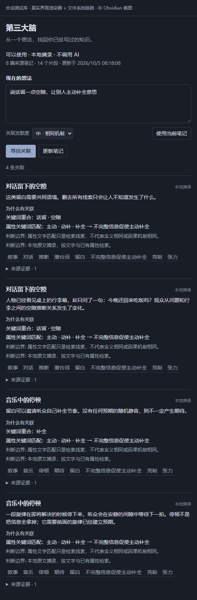
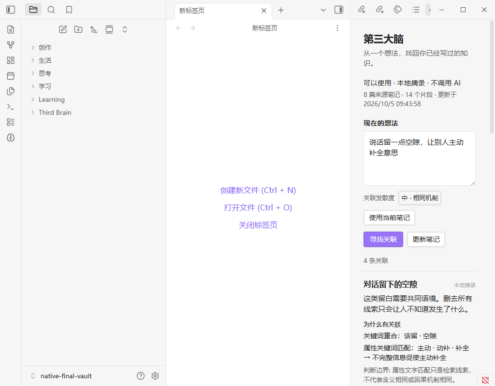

# 第三大脑 · Third Brain

从一个朦胧的想法，找回自己已经写过的知识。解释关联，带回原文，集成在 Obsidian 里。

[English](README.md) · [上手与模型配置](docs/GETTING-STARTED.md) · [隐私边界](docs/PRIVACY.md) · [架构](docs/ARCHITECTURE.md)

**开发预览版：**[0.1.0 预览发布](https://github.com/Yueyue673/obsidian-third-brain/releases/tag/0.1.0)已发布。修复后的本地摘录版本已在隔离合成笔记库完成原生 Obsidian 验收；发布资产已用无凭据方式重新下载，并与标签 CI 产物逐字节一致（见[验证范围](docs/VERIFICATION.md)）。真实 AI 服务兼容性与语义效果尚未验证。

## 安装

需要桌面版 Obsidian **1.11.5 或更新版本**。目前不宣称已进入社区插件目录。

**从 [0.1.0 预览发布](https://github.com/Yueyue673/obsidian-third-brain/releases/tag/0.1.0)安装：** 下载 `third-brain-0.1.0.zip`，用 `SHA256SUMS` 校验，然后**先使用可丢弃的测试库**，在其中创建 `.obsidian/plugins/third-brain/`，把 `main.js`、`manifest.json`、`styles.css`、`LICENSE` 直接放进去。在 Obsidian 设置 → 第三方插件中启用，打开「第三大脑」，点「更新笔记」。同样的文件也以散装资产提供。

**从源码构建：** 需要 Node **22.12+** 和 npm：

```sh
git clone https://github.com/Yueyue673/obsidian-third-brain.git
cd obsidian-third-brain
npm ci --ignore-scripts
npm run build
```

然后把 `dist/main.js`、`dist/manifest.json`、`dist/styles.css` 复制进同一个插件目录，用同样方式启用。

Release 标签与 manifest 版本一致。公开包已无凭据下载、校验哈希、装入隔离合成库并在原生 Obsidian 中加载；该包自身的完整点击旅程尚未重跑。源码构建、原生运行、公开下载是三种独立证据，不相互冒充。

默认本地摘录不需要账户、服务器或密钥。第三方插件具有广泛访问权限；在重要资料库启用前，请先审阅代码并保留备份。

## 你实际怎么用

写一个想法 → 点「寻找关联」→ 读关联理由和原文引用 → 点「查看原文」。不要求先打开某条旧笔记，也不要求提前知道标签。



*这是使用生产界面、协调层和文件适配器的合成库测试。不是原生 Obsidian 截图；示例已有明确属性，运行的是本地摘录，不代表真实 AI 自动分类质量。*



*这是原生 Obsidian 1.13.7 加载较早构建版本的隔离合成库截图：更新笔记 → 输入想法 → 关联解释 → 打开原文。它不是公开 Release 的安装证据。修复后版本的独立验收，以及较窄的网络观测范围，详见验证文档。*

- **原稿与编辑层分开。** 原始笔记只读。提炼出的 Markdown 与索引放在独立位置，已有手写文件和人工改过的生成文件受到保护。
- **关系有依据。** 文字、主题、概念、共同机制分开解释。发散度只选低 / 中 / 高；高发散仍需要出处，并标出类比边界。
- **整理保持安静。** 默认手动，可选每日或每周，仅在 Obsidian 打开时运行。不往原稿自动插入、不采集逐键输入、点击或停留，不建立行为画像。

没有旧笔记时，这个插件无法凭空创造你的个人知识。可以先用自己的资料，或体验明确标为虚构的[合成示例库](fixtures/sample-vault)。

## 本地与 AI，需要分清

| 模式 | 做什么 | 条件 |
| --- | --- | --- |
| 本地摘录 · 默认 | 提取可读片段，按文字和已有属性找关联。**不冒充 AI 语义理解。** | 零网络、无密钥 |
| 本机模型 | 通过你配置的 OpenAI 兼容接口提炼片段、解释查询属性 | 明确配置回环接口与模型名称 |
| 云端模型 | 普通笔记正文和查询可能发送到配置的服务；local/private 内容和词表不发送 | HTTPS、Obsidian 管理的密钥、明确同意 |

AI 可能理解错。引文校验只能证明引用确实出现在原文，不能证明每个解释都正确。脱敏也无法保证识别全部隐私。详细边界见[隐私说明](docs/PRIVACY.md)和[兼容与限制](docs/COMPATIBILITY.md)。

## 更新与旧知识

只处理发生变化的来源，未改变的笔记不重复调用模型。写入前再次核验来源版本；失败时保留完整版本，受保护文件不覆盖。

来源修改或消失后，旧引用不再作为可打开的推荐。插件不会替你判断知识是否正确，也不会判断你掌握了什么。原始笔记的修订仍由你决定。

## 文档与开发

[上手](docs/GETTING-STARTED.md) · [架构](docs/ARCHITECTURE.md) · [验证范围](docs/VERIFICATION.md) · [排障](docs/TROUBLESHOOTING.md) · [研究](docs/RESEARCH.md) · [贡献](CONTRIBUTING.md) · [安全反馈](SECURITY.md) · [更新记录](CHANGELOG.md)

使用 Node 22.12+：`npm ci --ignore-scripts`，然后运行 typecheck、test、build、smoke、privacy:check 与 release 脚本。`npm run demo` 仅启动合成测试库，使用真实界面和文件系统链路；它不是 Obsidian 窗口，也不会伪装成原生应用截图。

MIT 开源，独立实现。不发布私人笔记、聊天转写、机器配置或凭据，也不复制竞品代码。
